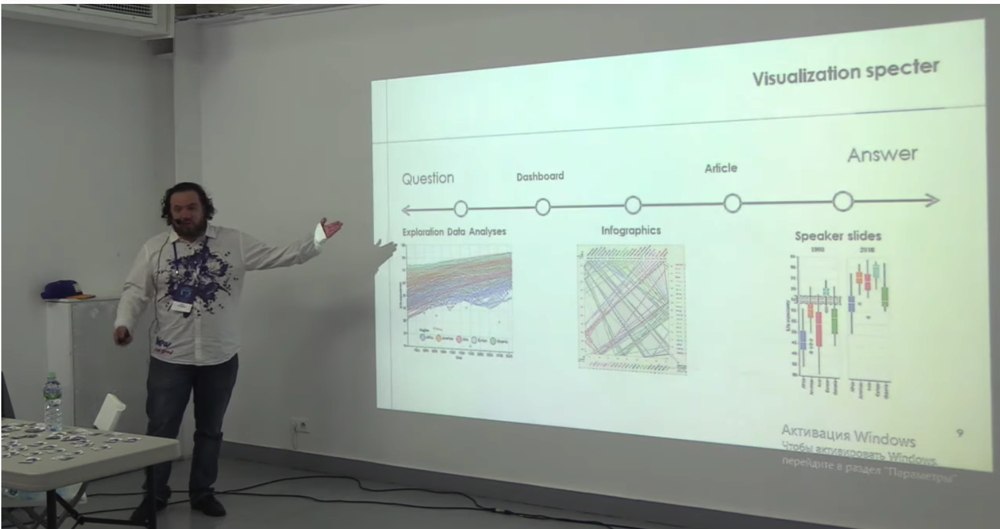

# DataFest2019Altair
## Интерактивные графики с примерами Altair (Vega-Lite)

### Видео

### Дополнительные материалы
* Слайды [pdf](DataFest_2019_Altair_v2.pdf), [pptx](DataFest_2019_Altair_v2.pptx) 
* Notebook 

### Ссылки
* Web site [Altair](https://altair-viz.github.io/)
* Web site [Vega](http://vega.github.io/)
* The Python Visualization Landscape [PyCon 2017](https://youtu.be/FytuB8nFHPQ) - Jake VanderPlas
* **Советую этот доклад:** How to Think about Data Visualization  [PyCon 2019](https://youtu.be/vTingdk_pVM) - Jake VanderPlas:
* Vega Lite: A Grammar of Interactive Graphics [Open Viz Conf 2017](https://youtu.be/9uaHRWj04D4) - Wongsuphasawat, Moritz, and Satyanarayan 
* Altair/Vega: интерактивные графики из ноутбука на сайт или d3.js на халяву [PyData Moscow #6](https://iliatimofeev.github.io/PyData2019Altair/) - Илья Тимофеев
* The best stats you've ever seen *Hans Rosling* [TED 2006](https://youtu.be/hVimVzgtD6w)

